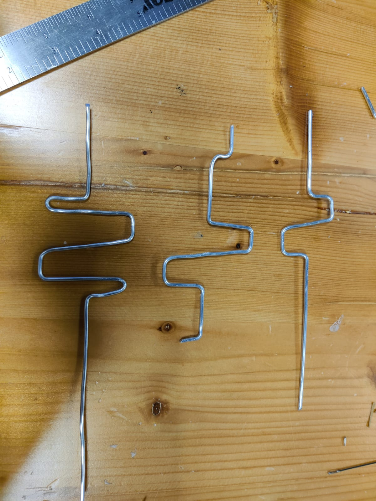
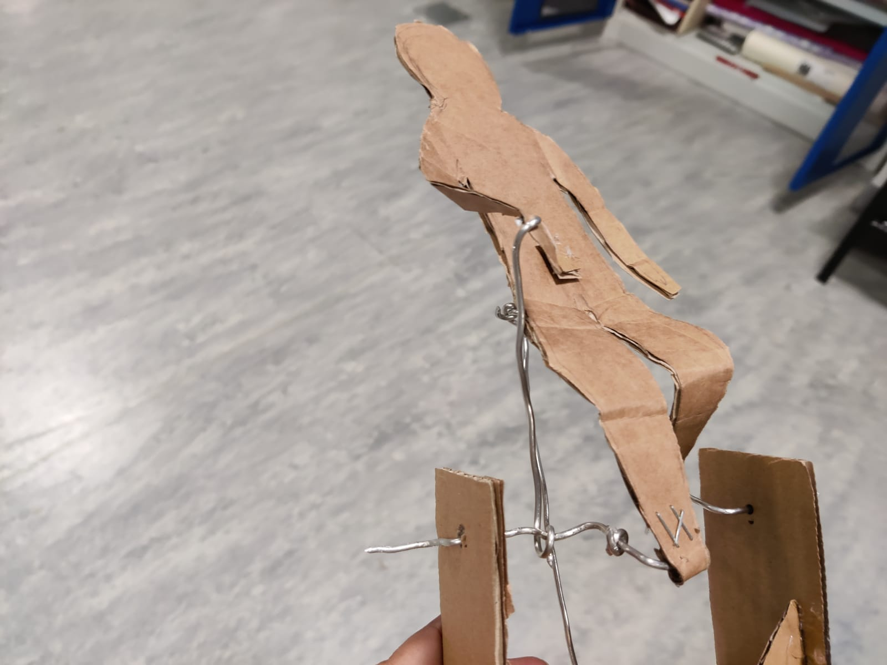

# Machine_Lab_Clock_automata
# group memebers
* Amina
* Nouf
* Shreya

# project idea
Automata clock and our project would feature cultural myth stories for children from the United Arab Emirates. 
more details [here](https://github.com/Nouf-Alabbasi/machineLab/tree/main/March_5)

# ◼️ general notes
* divid the day into 3 parts (8 hours each)
* the story for each myth progresses as type goes by.
* add text to narrate the stories
  * text using neopixel LED matrix
  * in a cloud on a conveyer belt
  * paper moving panaroma 
* 3D enviroment (3D houses, palm trees, sea...)

# ◼️ plan
* build protoypes of take different one part/mechanism of the project
* decide on the material for the parts
* test their size and placement in the box

# ◼️ Process

## ▪️ prototyping

### 🚶‍♂️walking

### ▫️ itteration 1:
https://user-images.githubusercontent.com/83579909/229476697-8c911cfe-e77f-49c3-8d46-06eed60ac385.MOV

https://user-images.githubusercontent.com/83579909/229476861-c5536d43-18e8-4643-8df6-acf7ed20a5c3.MOV

https://user-images.githubusercontent.com/83579909/229476889-a8772292-5971-4c60-af48-4960dfdd3cfd.MOV

https://user-images.githubusercontent.com/83579909/229476905-4b0bd903-2e9f-481b-a22f-011f9b9a5154.MOV

### ▫️▫️ itteration 2:

  
  

https://user-images.githubusercontent.com/83579909/229480438-e3e63115-dcd1-422e-bb8c-d9bf6c361b65.mp4

https://user-images.githubusercontent.com/83579909/229480474-48f5e8c1-fec8-41f8-9906-fa2d58c971c0.mp4

