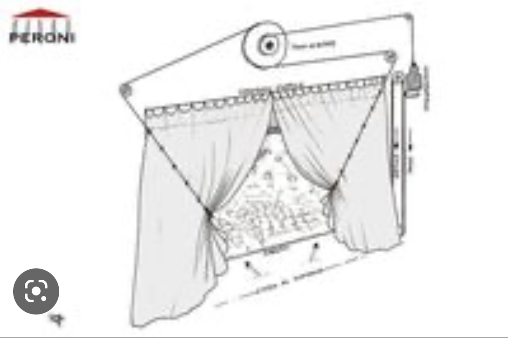

# ▪️ scene 1:
## 🪟 curtain
**material:**  
tbd

**prototypes**
We tried two methods of opening and closing the curtains. In one method we used a servo motor to move a peice of carboard with fabric stuck on it. The other method was to use a pully mechanism to pull the curtain open, and we used elastic to pull the curtain shut.
We tested out two fabircs to determine if we prefer a certain thickness or fabric type.

  

  

  

We also tested serveral methods to pull the curtain open. 
### method 1:
we tried to mimic this mechanism: 

  

  

 

### method 2:  

  

  

 

https://user-images.githubusercontent.com/83579909/230886131-b2b11269-b6f0-4981-90ef-da78aaf2dce8.mp4

### method 3
https://user-images.githubusercontent.com/83579909/230885786-bae0fd30-3dfd-4511-900e-8b2abe021e2a.MOV

### method 4

  

 

https://user-images.githubusercontent.com/83579909/230885859-856bee99-3d34-42a7-8576-64b2810d2e9e.MOV

## 🧒 child peaking out of window
**material:**  
tbd

**prototypes**
We used a servo motor tilt the the structure the child figure is one which allows it to look like its peaking out of the window.

https://user-images.githubusercontent.com/83579909/230883664-579d3d79-d005-4923-baad-bab363cfc187.MOV

 
 
 
 
 
 
 
 

# ▪️ scene 2:
## 🏃running
**material:**  
tbd

**prototypes**
We were inspired by the walkinig automata by [Federico Tobon](wolfcatworkshop.com).
This was our first prototype:

there were a few things we wanted to alter for the next prototype. We needed it to be running sideways, we also wanted to adde some arm movements and improve the protoype overall. We tested a few rode shapes until we found the ideal movement(this is the rode that determines the movement of the legs):

  

https://user-images.githubusercontent.com/83579909/230885625-82a91fc1-7493-469b-a6c9-6737dd387f1f.MOV

### Our second prototype:

https://user-images.githubusercontent.com/83579909/230885559-29868ef4-10ce-4732-a133-0dd6c5aabca7.mp4

 
 
 
 
 
 
 
 

# ▪️ scene 3:
## 🌊 waves
**material:**  
tbd

**prototypes**

https://user-images.githubusercontent.com/83579909/230886218-380bc7cd-bd7c-4cb8-8e67-5ea019923c30.mp4

